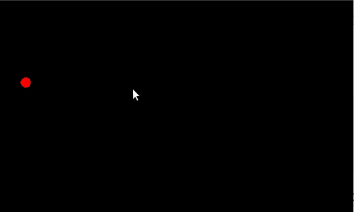

<h1>Group Steer</h1>

Each particle has a velicity vector, a desired velocity and a field of view. 
The particle's desired velocity is the average velocity of each of its neighbours.
In this way a group steering behaviour is exhibited. 
Colour corresponds to current direction of travel. 

